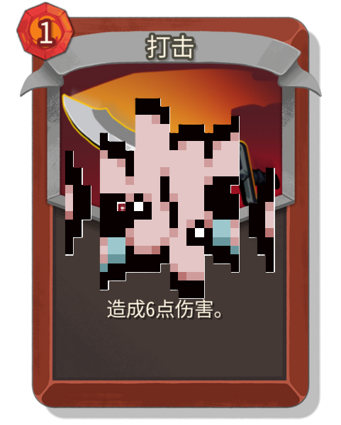

# Auto-Anthonyology

[English](README.md) | [简体中文](README.zh-CN.md)



Auto-Anthonyology is a Slay the Spire 2 card-pool randomizer inspired by The Binding of Isaac's DELETE THIS challenge.
At the start of a run, it decomposes native card designs into reusable unit operations and assembles a new card pool
with deterministic names, art, upgrades, targeting, effects, and runtime behavior.

The mod is in open beta and supports Ironclad, Silent, Defect, Necrobinder, Regent, and the two Colorless pools on
Slay the Spire 2 `0.111.x`.

## Highlights

- Replaces each supported pool while preserving its rarity counts and broad native distributions.
- Stores complete structured card definitions in run snapshots for stable save/load and multiplayer behavior.
- Offers Ultimate Chaos, balanced/aggressive values, numeric randomization, original-pool preservation, starting-card
  replacement, random card art, and three Surprise display modes.
- Keeps generated operations independent from localized prose through versioned `OperationRuntimeSpec` records.
- Provides Component API v2 for external character mods to register catalogs, occurrence/value/keyword policies, runtime
  handlers, hover tips, and generated-card slots.

## Installation

Subscribe on [Steam Workshop](https://steamcommunity.com/sharedfiles/filedetails/?id=3786611028), or copy a built
`AutoAnthony` folder into the game's `mods` directory. Every multiplayer participant should use the same mod version
and settings that affect the next run.

## Build

Requirements:

- Slay the Spire 2 `0.111.x`
- .NET 10 SDK
- Python 3
- PowerShell 7 or Windows PowerShell 5.1

Set `STS2_GAME_DIR` or pass the game directory explicitly:

```powershell
$env:STS2_GAME_DIR = "C:\path\to\Slay the Spire 2"
.\build.ps1
```

The installable package is written to `ChaosMode/build/AutoAnthony`. The build verifies the structured catalog,
runtime-spec registry, execution-route coverage, localization boundary, and an independently compiled API consumer.

Run the generator test directly with:

```powershell
dotnet run --project .\ChaosCardGenerator\ChaosCardGenerator.csproj -c Release -- --self-test
```

## Component API

Start with the [Component API Wiki](https://github.com/mewcodex/AutoAnthony/wiki/Component-API-Overview). A compact
in-repository contract is also available in [COMPONENT_API.md](COMPONENT_API.md), and
[`examples/WatcherComponentAdapter.cs.txt`](examples/WatcherComponentAdapter.cs.txt) demonstrates a framework-neutral
external-character adapter.

The API uses stable ASCII identifiers and structured runtime metadata. It does not require BaseLib, RitsuLib, or a
particular custom-character framework.

## Repository layout

- `ChaosMode/`: the game mod, runtime interpreter, snapshots, settings, and Harmony integration.
- `ChaosCardGenerator/`: standalone generation, balance, component catalogs, upgrades, and audits.
- `ApiContractSmoke/`: an external-consumer compile test for the public API surface.
- `scripts/`: catalog, execution, localization-boundary, and valuation audit entry points.
- `*_unit_operations.md`: reviewed bilingual authoring inputs embedded into the generator.
- `audits/structured_operation_refactor/`: reviewed compatibility fixtures required by the build.
- `tools/pack_godot_pck.py`: minimal Godot 4 PCK packer used by the build.

## Contributing

Please keep gameplay semantics out of localized text. New operations need a structured runtime specification, value
model, execution route, English and Chinese projections, and coverage in the relevant audit. Run the full build and
generator self-test before opening a pull request.

## Credits

Created by Alriph. Repository commits and releases are maintained through the `mewcodex` GitHub account.

## License

[MIT](LICENSE)
